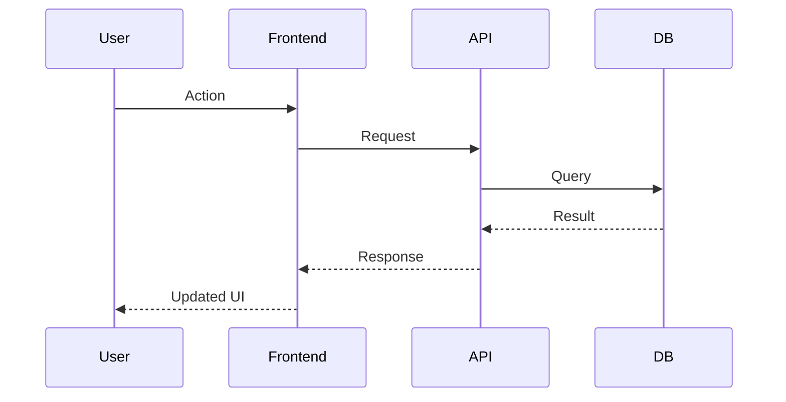
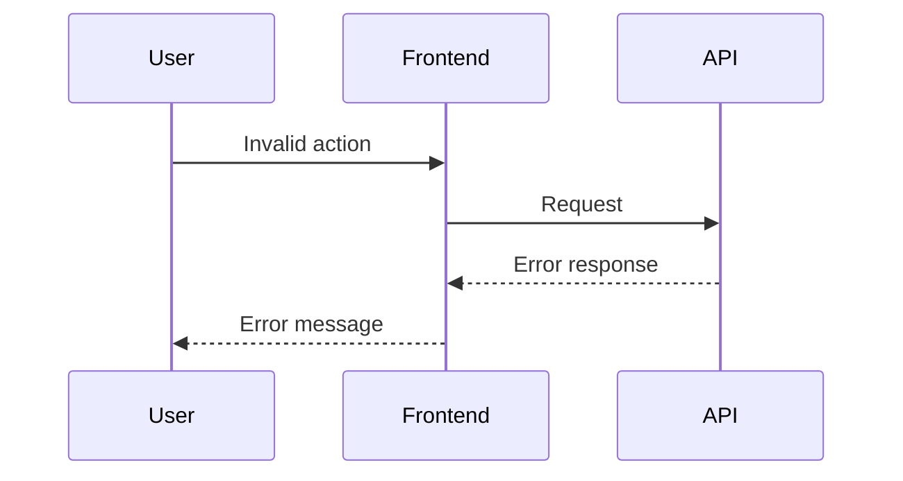

# <feature-slug> - Design

## Architecture overview

<High-level component diagram and responsibilities>

```
[Component A] --> [Component B] --> [Database]
                      |
                      v
              [External Service]
```

## Sequence diagrams

### Happy path



### Error cases



## API design

| Endpoint | Method | Request | Response | Errors |
|----------|--------|---------|----------|--------|
| /api/... | POST | `{ field: type }` | `{ field: type }` | 400, 401, 500 |
| /api/... | GET | query params | `{ field: type }` | 404, 500 |

### Request/Response examples

**POST /api/example**
```json
// Request
{
  "field": "value"
}

// Response (200)
{
  "id": "uuid",
  "field": "value",
  "createdAt": "timestamp"
}

// Error (400)
{
  "error": "validation_error",
  "message": "Field is required"
}
```

## Data model changes

### New tables

| Table | Purpose |
|-------|---------|
| table_name | Description |

### Schema

```sql
CREATE TABLE table_name (
  id UUID PRIMARY KEY DEFAULT gen_random_uuid(),
  field TEXT NOT NULL,
  created_at TIMESTAMPTZ DEFAULT now(),
  updated_at TIMESTAMPTZ DEFAULT now()
);

CREATE INDEX idx_table_field ON table_name(field);
```

### RLS policies

```sql
-- Enable RLS
ALTER TABLE table_name ENABLE ROW LEVEL SECURITY;

-- Policy: Users can only see their own data
CREATE POLICY "Users can view own data"
  ON table_name FOR SELECT
  USING (auth.uid() = user_id);

-- Policy: Users can insert own data
CREATE POLICY "Users can insert own data"
  ON table_name FOR INSERT
  WITH CHECK (auth.uid() = user_id);
```

## Security considerations

- [ ] **Authentication:** Is auth required? Which endpoints?
- [ ] **Authorization:** Who can access what? RLS policies defined?
- [ ] **Input validation:** All inputs validated and sanitized?
- [ ] **Rate limiting:** Needed for any endpoints?
- [ ] **Data encryption:** Sensitive data encrypted at rest?
- [ ] **Audit logging:** Actions logged for compliance?

## Error handling

| Error case | HTTP code | User message | Recovery action |
|------------|-----------|--------------|-----------------|
| Invalid input | 400 | "Please check your input" | Show validation errors |
| Unauthorized | 401 | "Please log in" | Redirect to login |
| Not found | 404 | "Resource not found" | Show empty state |
| Server error | 500 | "Something went wrong" | Retry with backoff |

## Data flow

```
User Action
    |
    v
[Frontend Component]
    |
    | (fetch/mutation)
    v
[API Route Handler]
    |
    | (validate, auth check)
    v
[Supabase Client]
    |
    | (query/insert/update)
    v
[PostgreSQL + RLS]
    |
    | (if needed)
    v
[External Service]
```

## Migration strategy

1. **Database changes:** Apply migrations to staging first
2. **Backward compatibility:** Ensure old clients work during rollout
3. **Rollback plan:** Document how to revert if issues arise
4. **Data migration:** If existing data needs transformation

## Risks and tradeoffs

| Risk | Likelihood | Impact | Mitigation |
|------|------------|--------|------------|
| <Risk description> | Low/Med/High | Low/Med/High | <How to prevent or handle> |

## Alternatives considered

| Option | Pros | Cons | Why rejected |
|--------|------|------|--------------|
| <Alternative approach> | <Benefits> | <Drawbacks> | <Reason not chosen> |
